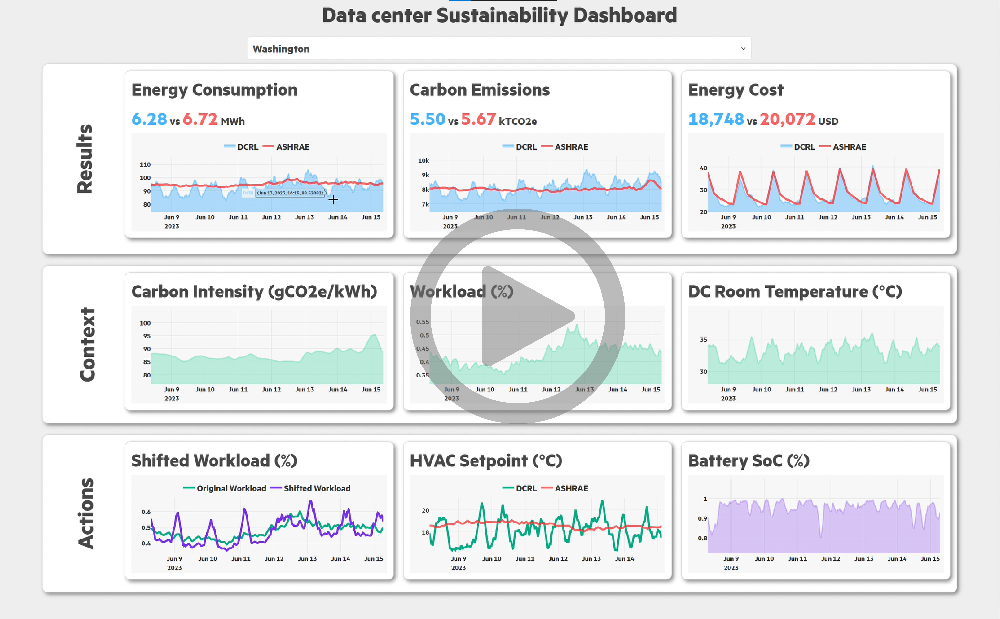

# SustainDC (DCRL-Green) - Benchmarking for Sustainable Data Center Control

## Table of Contents
1. [Introduction](#introduction)
2. [Features](#features)
3. [Installation](#installation)
4. [Quick Start Guide](#quick-start-guide)
5. [Environment Details](#environment-details)
6. [Customization](#customization)
7. [Benchmarking Algorithms](#benchmarking-algorithms)
8. [Evaluation Metrics](#evaluation-metrics)
9. [Contributing](#contributing)
10. [License](#license)
11. [Acknowledgments](#acknowledgments)


## Introduction
SustainDC is a set of Python environments for benchmarking multi-agent reinforcement learning (MARL) algorithms in data centers (DC). It focuses on sustainable DC operations, including workload scheduling, cooling optimization, and auxiliary battery management.

<p align="center">
  
</p>


## Features
- **Highly Customizable Environments:** Allows users to define and modify various aspects of data center operations, including server configurations, cooling systems, and workload traces.
- **Multi-Agent Support:** Enables the testing of MARL controllers with both homogeneous and heterogeneous agents, facilitating the study of collaborative and competitive strategies in data center management.
- **Gymnasium Integration:** Environments are wrapped in the Gymnasium `Env` class, making it easy to benchmark different control strategies using standard reinforcement learning libraries.
- **Realistic External Variables:** Incorporates real-world data such as weather conditions, carbon intensity, and workload traces to simulate the dynamic and complex nature of data center operations.
- **Collaborative Reward Mechanisms:** Supports the design of custom reward structures to promote collaborative optimization across different data center components.
- **Benchmarking Suite:** Includes scripts and tools for evaluating the performance of various MARL algorithms, providing insights into their effectiveness in reducing energy consumption and carbon emissions.

<p align="center">
  
</p>


## Installation
### Prerequisites
- Python 3.7+
- Dependencies listed in `requirements.txt`

### Steps
1. Clone the repository:
    ```bash
    git clone https://github.com/HewlettPackard/dc-rl.git
    ```
2. Navigate to the repository directory:
    ```bash
    cd dc-rl
    ```
3. Install the required packages:
    ```bash
    pip install -r requirements.txt
    ```


## Quick Start Guide
1. **Setup Configuration:**
   Customize the `dc_config.json` file to specify your DC environment settings.

2. **Run Example:**
   Execute a simple example to get started:
   ```bash
   python examples/run_random.py
   ```

3. **Run Example:**
   Execute a simple example to get started:
   ```bash
   python examples/evaluate.py
   ```


## Environment Details

### Workload Environment
The Workload Environment in SustainDC manages the execution and scheduling of delayable workloads within the data center (DC). It includes open-source workload traces from Alibaba and Google data centers, which represent the computational demand placed on the DC. Users can customize this environment by adding new workload traces or modifying the existing ones. The workload traces are used to simulate the tasks that the data center needs to process, providing a realistic and dynamic workload for benchmarking purposes.


### Data Center Environment
The Data Center Environment models the IT and HVAC systems of a data center, focusing on optimizing energy consumption and cooling. This environment simulates the electrical and thermal behavior of the DC components, including servers, cooling systems, and other infrastructure. Users can customize various parameters such as the number of servers, cooling setpoints, and the configuration of the HVAC system. This environment helps evaluate the performance of different control strategies aimed at reducing energy consumption and improving the overall efficiency of the data center.

<p align="center">
  
</p>


### Battery Environment
The Battery Environment simulates the charging and discharging cycles of batteries used in the data center. It models how batteries can be charged from the grid during periods of low carbon intensity and provide auxiliary energy during periods of high carbon intensity. This environment helps in assessing the effectiveness of battery management strategies in reducing the carbon footprint and optimizing energy usage in the data center.


### External Variables
SustainDC uses several external variables to provide a realistic simulation environment:

- **Weather:** The Weather variable captures the ambient environmental conditions that impact the data center's cooling requirements. Weather data is provided in the .epw format and includes typical weather conditions for various locations where data centers are commonly situated. Users can customize this data to reflect the specific climate of their region.

- **Carbon Intensity:** The Carbon Intensity (CI) variable represents the carbon emissions associated with electricity consumption. SustainDC includes CI data files for various locations, which are used to simulate the carbon footprint of the data center's energy usage. Users can add new CI files or modify existing ones to reflect the carbon intensity of their local grid.

- **Workload Traces:** Workload traces represent the computational demand placed on the data center. By default, SustainDC includes workload traces from Alibaba and Google data centers. These traces can be customized by adding new data or modifying the existing traces to simulate different types of workloads and their impact on the data center's operations.

### Connections Between Environments
The three environments in SustainDC are interconnected to provide a comprehensive simulation of data center operations:

- The **Workload Environment** generates the computational demand that the **Data Center Environment** must process. This includes managing the scheduling of delayable tasks to optimize energy consumption and reduce the carbon footprint.

<p align="center">
  
</p>


- The **Data Center Environment** handles the cooling and IT operations required to process the workloads. It is directly influenced by the workload generated, as higher computational demand results in increased heat generation, necessitating more cooling and energy consumption.

<p align="center">
  
</p>


- The **Battery Environment** supports the DC by providing auxiliary energy during periods of high carbon intensity, helping to reduce the overall carbon footprint of the data center's operations. It is affected by both the **Workload Environment** and the **Data Center Environment**. The workload affects heat generation, which in turn impacts the cooling requirements and energy consumption of the data center, thereby influencing the battery's charging and discharging cycles.
  
<p align="center">
  
</p>

Together, these interconnected environments provide a realistic and dynamic platform for benchmarking multi-agent reinforcement learning algorithms aimed at enhancing the sustainability and efficiency of data center operations.


## Customization
SustainDC offers extensive customization options to tailor the environments to specific needs and configurations. Users can modify various parameters and components across the Workload, Data Center, and Battery environments, as well as external variables like weather carbon intensity data, and workload trace.

<p align="center">
  
</p>


### Main Configuration File
The main environment for wrapping the environments is `dclr_env_harl_partialobs.py`, which reads configurations from `dc_config.json` and manages the external variables using managers for weather, carbon intensity, and workload.

#### Example Configuration
```bash
env_config = {
    # Agents active
    'agents': ['agent_ls', 'agent_dc', 'agent_bat'],

    # Datafiles
    'location': 'ny',
    'cintensity_file': 'NYIS_NG_&_avgCI.csv',
    'weather_file': 'USA_NY_New.York-Kennedy.epw',
    'workload_file': 'Alibaba_CPU_Data_Hourly_1.csv',

    # Data Center maximum capacity
    'datacenter_capacity_mw': 1,
    
    # Battery capacity
    'max_bat_cap_Mw': 2,
    
    # Collaborative weight in the reward
    'individual_reward_weight': 0.8,
    
    # Flexible load ratio
    'flexible_load': 0.4,
    
    # Specify reward methods
    'ls_reward': 'default_ls_reward',
    'dc_reward': 'default_dc_reward',
    'bat_reward': 'default_bat_reward'
}
```


### Data Center Configuration File
The customization of the data center is done through the `dc_config.json` file located in the `utils` folder. This file allows users to specify every aspect of the data center environment design.

#### Example Configuration File Structure
```json
{
    "data_center_configuration": {
        "NUM_ROWS": 4,
        "NUM_RACKS_PER_ROW": 5,
    },
    "hvac_configuration": {
        "C_AIR": 1006,
        "RHO_AIR": 1.225,
        "CRAC_SUPPLY_AIR_FLOW_RATE_pu": 0.00005663,
        "CRAC_REFRENCE_AIR_FLOW_RATE_pu": 0.00009438,
        "CRAC_FAN_REF_P": 150,
        "CHILLER_COP_BASE": 5.0,
        "CHILLER_COP_K": 0.1,
        "CHILLER_COP_T_NOMINAL": 25.0,
        "CT_FAN_REF_P": 1000,
        "CT_REFRENCE_AIR_FLOW_RATE": 2.8315,
        "CW_PRESSURE_DROP": 300000,
        "CW_WATER_FLOW_RATE": 0.0011,
        "CW_PUMP_EFFICIENCY": 0.87,
        "CT_PRESSURE_DROP": 300000,
        "CT_WATER_FLOW_RATE": 0.0011,
        "CT_PUMP_EFFICIENCY": 0.87
    },
    "server_characteristics": {
        "CPU_POWER_RATIO_LB": [0.01, 1.00],
        "CPU_POWER_RATIO_UB": [0.03, 1.02],
        "IT_FAN_AIRFLOW_RATIO_LB": [0.01, 0.225],
        "IT_FAN_AIRFLOW_RATIO_UB": [0.225, 1.0],
    }
}
```

### Adding New Workload Data

#### Overview
Workload traces represent the computational demand placed on the data center. By default, SustainDC includes workload traces from Alibaba and Google data centers. These traces are used to simulate the tasks that the data center needs to process, providing a realistic and dynamic workload for benchmarking purposes.

#### Data Source
The default workload traces are extracted from:
- Alibaba 2017 CPU Data ([Link](https://github.com/alibaba/clusterdata))
- Google 2011 CPU Data ([Link](https://github.com/google/cluster-data))

#### Expected File Format
Workload trace files should be in CSV format, with two columns: a timestamp or index (must be unnamed), and the corresponding DC Utilization (`cpu_load`). The CPU load must be expressed as a fraction of the DC utilization (between 0 and 1). The workload file must contain one year of data with an hourly periodicity (365*24=8760 rows). 

#### Example Workload Trace File
```csv
,index,cpu_load
1,0.380
2,0.434
3,0.402
4,0.485
...
```

#### Integration Steps
1. Place the new workload trace file in the `data/Workload` folder.
2. Update the workload_file entry in env_config with the path to the new workload trace file.


### Adding New Carbon Intensity Data

#### Overview
Carbon Intensity (CI) data represents the carbon emissions associated with electricity consumption. SustainDC includes CI data files for various locations to simulate the carbon footprint of the data center's energy usage.

#### Data Source
The default carbon intensity data files are extracted from:
- U.S. Energy Information Administration (EIA) API: [https://api.eia.gov/bulk/EBA.zip](https://api.eia.gov/bulk/EBA.zip)

#### Expected File Format
Carbon intensity files should be in CSV format, with columns representing different energy sources and the average carbon intensity. The columns typically include:
- `timestamp`: The time of the data entry.
- `WND`: Wind energy.
- `SUN`: Solar energy.
- `WAT`: Water (hydropower) energy.
- `OIL`: Oil energy.
- `NG`: Natural gas energy.
- `COL`: Coal energy.
- `NUC`: Nuclear energy.
- `OTH`: Other energy sources.
- `avg_CI`: The average carbon intensity.

#### Example Carbon Intensity File
```csv
timestamp,WND,SUN,WAT,OIL,NG,COL,NUC,OTH,avg_CI
2022-01-01 00:00:00+00:00,1251,0,3209,0,15117,2365,4992,337,367.450
2022-01-01 01:00:00+00:00,1270,0,3022,0,15035,2013,4993,311,363.434
2022-01-01 02:00:00+00:00,1315,0,2636,0,14304,2129,4990,312,367.225
2022-01-01 03:00:00+00:00,1349,0,2325,0,13840,2334,4986,320,373.228
...
```

#### Integration Steps
1. Add the new carbon intensity data files to the `data/CarbonIntensity` folder.
2. Update the `cintensity_file` entry in `env_config` with the path to the new carbon intensity file.


### Adding New Weather Data

#### Overview
Weather data captures the ambient environmental conditions that impact the data center's cooling requirements. SustainDC includes weather data files in the .epw format from various locations where data centers are commonly situated.

#### Data Source
The default weather data files are extracted from:
- EnergyPlus Weather Data: [https://energyplus.net/weather](https://energyplus.net/weather)

#### Expected File Format
Weather data files should be in the .epw (EnergyPlus Weather) format, which includes hourly data for various weather parameters such as temperature, humidity, wind speed, etc.

#### Example Weather Data File
Below is a partial example of an .epw file:
```epw
LOCATION,New York JFK Int'l Ap NY USA,USA,NY,716070,40.63,-73.78,-5.0,3.4
DESIGN CONDITIONS,1,New York JFK Int'l Ap Ann Clg .4% Condns DB=>MWB,25.0
...
DATA PERIODS,1,1,Data,Sunday, 1/ 1,12/31
...
2022,1,1,1,60.1,45.1,1004.1,0,0,4.1,80.1,30.0
2022,1,1,2,59.8,44.9,1004.0,0,0,4.1,80.0,29.8
...
```

#### Integration Steps
1. Add the new weather data files in the .epw format to the `data/Weather` folder.
2. Update the `weather_file` entry in `env_config` with the path to the new weather file.


### Custom Reward Structures
SustainDC allows users to define custom reward structures to promote collaborative optimization across different data center components. Users can modify the reward functions in the `utils/reward_creator.py` file to suit their specific optimization goals.

By leveraging these customization options, users can create highly specific and optimized simulations that reflect the unique requirements and challenges of their data center operations.


## Dashboard

To watch the video, click on the screenshot below (right-click and select "Open link in new tab" to view in a new tab):

[](https://www.dropbox.com/scl/fi/85gumlvjgbbk5kwjhee3i/Data-Center-Green-Dashboard-ver2.mp4?rlkey=w3mu21qqdk9asi826cjyyutzl&dl=0)

If you wish to download the video directly, [click here](https://www.dropbox.com/scl/fi/85gumlvjgbbk5kwjhee3i/Data-Center-Green-Dashboard-ver2.mp4?rlkey=w3mu21qqdk9asi826cjyyutzl&dl=1).


Demo of DCRL functionality
[](https://colab.research.google.com/drive/1XF92aR6nVYxENrviHeFyuRu0exKBb-nh?usp=sharing)
---

This repository contains the datasets and code for the paper DCRL-Green: Sustainable Data Center Environment and Benchmark for Multi-Agent Reinforcement Learning.
---
[](https://colab.research.google.com/drive/1ldxlcG_prPw9U26alK9oRN2XvxrxNSDP?usp=sharing)


<p align="center">
  
</p>

## Introduction
DCRL-green is a framework for testing multi-agent Reinforcement Learning (MARL) algorithm that optimizes data centers for multiple objectives of carbon footprint reduction, energy consumption, and energy cost. It uses OpenAI Gym standard and supports modeling and control of three different types of problems: Carbon aware flexible load shifting, Data center HVAC cooling energy optimization and carbon aware battery auxiliary supply.

Main contributions of DCRL-Green:

- the first OpenAI framework, to the best of our knowledge, focused on carbon footprint reduction for data centers
- modular design meaning users can utilize pre-defined modules for load shifting, energy and battery or build their own 
- scalable architecture that allows multiple different types of modules and connections between them
- robust data center model that provides in-depth customization to fit users' needs 
- provides pre-defined reward functions as well as interface to create custom reward functions 
- built-in mechanisms for reward shaping focused on degree of cooperation between the agents and level of prioritization of carbon footprint reduction versus energy cost
- custom reward shaping through custom reward functions 
- build-in MARL algorithms, with ability to incorporate user-specified custom agents 

Currently, we provide two versions for the data center dynamics. 

`DCRL (dcrl_env.py)`: This default version is implemented in Python and can be used with the prerequisites listed below. 

`DCRLeplus (dcrl_eplus_env.py)`: This uses the [EnergyPlus](https://energyplus.net/) model of a data center from the [Sinergym](https://github.com/ugr-sail/sinergym) repository. We provide a docker image for this environment as well as instructions for manual installation.

## Works Utilizing DCRL-Green

**[Real-time Carbon Footprint Minimization in Sustainable Data Centers wth Reinforcement Learning](https://www.climatechange.ai/papers/neurips2023/28).** Best Paper - Best ML Innovation award at NeurIPS Climate Change AI Workshop.

## Documentation and Installation
Refer to the [docs](https://hewlettpackard.github.io/dc-rl/) for documentation of the DCRL-Green.

# Quick Start Guide

## Prerequisites
- Linux OS (Ubuntu 20.04)
- Conda
- [Optional] Docker (see [docs](https://docs.docker.com/get-docker/)) (Only required for the Sinergym-EnergyPlus Environment)


## Installation
First, download the repository. If using HTML, execute:
```bash
$ git clone https://github.com/HewlettPackard/dc-rl.git
```
If using SSH, execute:
```bash
$ git clone git@github.com:HewlettPackard/dc-rl.git
```
### Installing the DCRL environment 
Make sure you have conda installed. For more instructions on installing conda please check the [documentation](https://conda.io/projects/conda/en/latest/user-guide/install/linux.html#install-linux-silent).

Change the current working directory to the dc-rl folder:

```bash
$ cd dc-rl
```

Create a conda environment and install dependencies:
```bash
$ conda create -n dcrl python=3.10
$ conda activate dcrl
$ pip install -r requirements.txt
```

### Installing the DCRLeplus environment
Make sure you are inside the ```dc-rl``` directory first. 

To install the DCRLeplus environment using a docker image (**recommended**) run the following command to pull the image:

```bash
$ docker pull agnprz/carbon_sustain:v3
```

To install DCRLeplus manually (**not recommended**), you need to follow the [instructions](https://ugr-sail.github.io/sinergym/compilation/main/pages/installation.html#manual-installation) to manually install Sinergym. Make sure all the required components (custom Python environment, EnergyPlus, and BCVTB) are correctly installed.   

## Usage
Before running the DCRL environment, make sure you are in the ```dc-rl``` folder. If you are in your home directory, run ```cd dc-rl``` or ```cd PATH_TO_PROJECT``` depending on where you downloaded the GitHub repository. 

### Running the DCRL environment with a random agent
To run an episode of the environment with a random agent execute:
```bash
$ python dcrl_env.py
```

### Training an RL agent on the DCRL environment
To start training, run the following command:

(Note: The `episode_reward_mean` will be `nan` for the first few iterations until 1 episode is completed)

For PPO:
```bash
$ python train_ppo.py
```

For MADDPG:
```bash
$ python train_maddpg.py
```

For A2C:
```bash
$ python train_a2c.py
```

### Training on the DCRLeplus environment
First, run the docker image that you previosuly downloaded:

```bash
$ docker run -t -i -v $PWD:/sinergym/dc-rl --shm-size=10.24gb agnprz/carbon_sustain:v3
```

Finally to run DCRLeplus use:
```bash
$ cd dc-rl
$ EPLUS=1 python train_ppo.py
```
Note that this will use ```PPO``` agents; for ```MADDPG``` use the ```train_maddpg.py``` Python script and for ```A2C``` use the ```train_a2c.py``` script. Other algorithms can be used, it is only necessary to utilize the RLLib [algorithms](https://docs.ray.io/en/latest/rllib/rllib-algorithms.html).

### Running in Background Mode
If you want to run the DCRL-Green framework in background mode use the following command:

```bash
$ nohup python PYTHON_SCRIPT > OUTPUT_FILE.txt  &
```
where ```PYTHON_SCRIPT``` is the script you want to run (e.g., ```train_ppo.py```) and ```OUTPUT_FILE``` is the name of the file that will contain the output (e.g. ```latest_experiment_output.txt```).

### Monitoring Training
Monitor the training using TensorBoard. By default, the location of the training data is at ```./results```. To visualize, run:

```bash
$ tensorboard --logdir ./results
```

## Contributing
Contributions are welcome. For major changes, please open an issue first to discuss what you would like to change. Please ensure to update tests as appropriate.

## Contact
For any questions or concerns, please open an issue in this repository.
