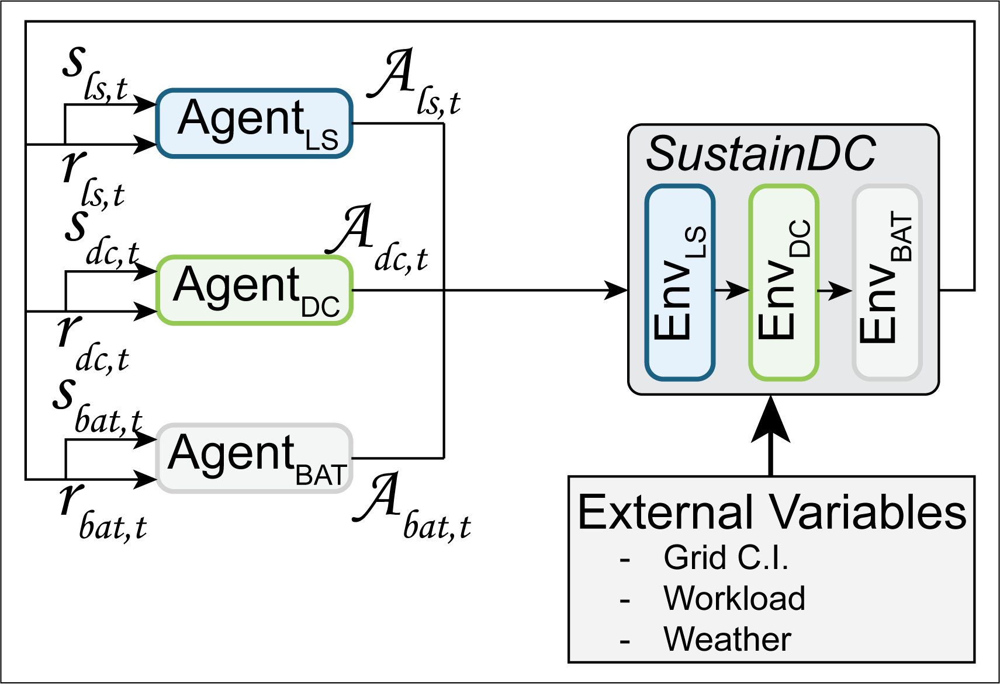

# SustainDC (DCRL-Green) - Benchmarking for Sustainable Data Center Control

## Table of Contents
1. [Introduction](#introduction)
2. [Features](#features)
3. [Installation](#installation)
4. [Quick Start Guide](#quick-start-guide)
5. [Environment Details](#environment-details)
6. [Customization](#customization)
7. [Benchmarking Algorithms](#benchmarking-algorithms)
8. [Evaluation Metrics](#evaluation-metrics)
9. [Dashboard](#dashboard)
10. [Contributing](#contributing)
11. [Contact](#contact)
12. [License](#license)

## Disclaimer

This work builds on our previous research and extends the methodologies and insights gained from our previous work. The original code, referred to as DCRL-Green, can be found in the legacy branch of this repository. For users looking for the original implementation, please visit the [legacy branch](https://github.com/HewlettPackard/dc-rl/tree/legacy). The current repository, **SustainDC**, represents an advanced iteration of DCRL-Green, incorporating enhanced features and improved benchmarking capabilities. This evolution reflects our ongoing commitment to advancing sustainable data center control. Consequently, the repository name remains dc-rl to maintain continuity with our previous work.


## Introduction
**SustainDC** is a set of Python environments for benchmarking multi-agent reinforcement learning (MARL) algorithms in data centers (DC). It focuses on sustainable DC operations, including workload scheduling, cooling optimization, and auxiliary battery management. This repository contains the code and datasets for the paper `SustainDC - Benchmarking for Sustainable Data Center Control`.

<p align="center">
  
</p>

Demo of **SustainDC**
[](https://colab.research.google.com/drive/1XF92aR6nVYxENrviHeFyuRu0exKBb-nh?usp=sharing)

TODO: This demo should be updated

### Documentation and Installation
Refer to the [docs](https://hewlettpackard.github.io/dc-rl/) for broader documentation of **SustainDC**.

## Features
- **Highly Customizable Environments:** Allows users to define and modify various aspects of DC operations, including server configurations, cooling systems, and workload traces.
- **Multi-Agent Support:** Enables the testing of MARL controllers with both homogeneous and heterogeneous agents, facilitating the study of collaborative and competitive strategies in DC management.
- **Gymnasium Integration:** Environments are wrapped in the Gymnasium `Env` class, making it easy to benchmark different control strategies using standard reinforcement learning libraries.
- **Realistic External Variables:** Incorporates real-world data such as weather conditions, carbon intensity, and workload traces to simulate the dynamic and complex nature of DC operations.
- **Collaborative Reward Mechanisms:** Supports the design of custom reward structures to promote collaborative optimization across different DC components.
- **Benchmarking Suite:** Includes scripts and tools for evaluating the performance of various MARL algorithms, providing insights into their effectiveness in reducing energy consumption and carbon emissions.

<p align="center">
  
</p>


## Installation
### Prerequisites
- Python 3.7+
- Dependencies listed in `requirements.txt`

### Steps
1. Clone the repository:
    ```bash
    git clone https://github.com/HewlettPackard/dc-rl.git
    ```
2. Navigate to the repository directory:
    ```bash
    cd dc-rl
    ```
3. Install the required packages:
    ```bash
    pip install -r requirements.txt
    ```


## Quick Start Guide
1. **Setup Configuration:**
   Customize the `dc_config.json` file to specify your DC environment settings.

2. **Environment Configuration:**
   The main environment for wrapping the environments is `dclr_env_harl_partialobs.py`, which reads configurations from `env_config` and manages the external variables using managers for weather, carbon intensity, and workload. 

3. **Train Example:**
   Specify `location` inside `harl.config.envs_cfgs.dcrl.yaml`. Specify other algorithm hyperparameteres in `harl.config.algos_cfgs.happo.yaml`. User can also specify the choice of reinforcement learning vs baseline agents in the `happ.yaml`.
   
   ```bash
   python train.py --algo happo --exp_name happo
   ```

4. **Monitor training on Tensorboard**
   ```bash
   tensorboard --logdir /results/dcrl/<location>/happo
   ```

5. **Evaluation Example:**
   
   ```bash
   python eval_harl.py
   ```
   The results are stored in the `SAVE_EVAL`(can be configured inside `eval_harl.py` with other parameters like choice of `checkpoint`, `location`, `run` etc) folder.

## Environment Details

**SustainDC** consists of three interconnected environments that simulate various aspects of data center operations: the **Workload Environment**, the **Data Center Environment**, and the **Battery Environment**. These environments work together to provide a comprehensive platform for benchmarking MARL algorithms aimed at optimizing energy consumption and reducing the carbon footprint of DCs.

### Workload Environment
The **Workload Environment** manages the execution and scheduling of delayable workloads within the data center. It simulates the computational demand placed on the data center by using real-world workload traces from sources like Alibaba and Google.

<p align="center">
  
</p>

#### Key Features
- **Observation Space:** 
  - Time of Day and Year: Provides a periodic understanding of time using sine and cosine representations.
  - Grid Carbon Intensity (CI): Includes current and forecasted carbon intensity values to help the agent optimize workload scheduling based on carbon emissions.
  - Rescheduled Workload Left: Tracks the amount of workload that has been rescheduled but not yet executed.
  
- **Action Space:** 
  - Store Delayable Tasks: Allows the agent to store delayable tasks for future execution.
  - Compute All Immediate Tasks: Enables the agent to process all current tasks immediately.
  - Maximize Throughput: Balances immediate and delayed tasks based on the current carbon intensity.

### Data Center Environment
The **Data Center Environment** models the IT and HVAC systems of a data center, focusing on optimizing energy consumption and cooling. It simulates the electrical and thermal behavior of the DC components, including servers and cooling systems.

<p align="center">
  
</p>

<p align="center">
  
</p>

#### Key Features
- **Observation Space:**
  - Time of Day and Year: Provides a periodic understanding of time using sine and cosine representations.
  - Ambient Weather (Dry Bulb Temperature): Current outside temperature affecting the cooling load.
  - IT Room Temperature: Current temperature inside the data center, crucial for maintaining optimal server performance.
  - Previous Step Energy Consumption: Historical data on cooling and IT energy consumption for trend analysis.
  - Grid Carbon Intensity (CI): Forecasted carbon intensity values to optimize cooling strategies.

- **Action Space:**
  - Decrease Setpoint: Lowers the cooling setpoint to increase cooling, consuming more energy for cooling but reducing IT energy consumption.
  - Maintain Setpoint: Keeps the current cooling setpoint constant.
  - Increase Setpoint: Raises the cooling setpoint to reduce cooling energy consumption but increases IT energy consumption.

### Battery Environment
The **Battery Environment** simulates the charging and discharging cycles of batteries used in the DC. It models how batteries can be charged from the grid during periods of low carbon intensity and provide auxiliary energy during periods of high carbon intensity.

<p align="center">
  
</p>

#### Key Features
- **Observation Space:**
  - Time of Day and Year: Provides a periodic understanding of time using sine and cosine representations.
  - State of Charge (SoC): Current energy level of the battery.
  - Grid Energy Consumption: Combined energy consumption of IT and cooling systems.
  - Grid Carbon Intensity (CI): Current and forecasted carbon intensity values to determine optimal charging and discharging times.

- **Action Space:**
  - Charge Battery: Stores energy in the battery during periods of low carbon intensity.
  - Hold Energy: Maintains the current state of charge.
  - Discharge Battery: Provides auxiliary energy to the data center during periods of high carbon intensity.

### Interconnected Environments
These three environments are interconnected to simulate realistic DC operations:

- The **Workload Environment** generates the computational demand that the **Data Center Environment** must process. This includes managing the scheduling of delayable tasks to optimize energy consumption and reduce the carbon footprint.

- The **Data Center Environment** handles the cooling and IT operations required to process the workloads. Higher computational demand results in increased heat generation, necessitating more cooling and energy consumption.

- The **Battery Environment** supports the DC by providing auxiliary energy during periods of high carbon intensity, helping to reduce the overall carbon footprint. It is affected by both the **Workload Environment** and the **Data Center Environment**. The workload impacts heat generation, which in turn affects the cooling requirements and energy consumption, influencing the battery's charging and discharging cycles.

<p align="center">
  
</p>

Together, these interconnected environments provide a dynamic platform for benchmarking MARL algorithms, helping to develop strategies for more sustainable and efficient DC operations.


### External Input Data
**SustainDC** uses external input data to provide a realistic simulation environment:

#### Workload
The Workload external data in **SustainDC** represents the computational demand placed on the DC. By default, **SustainDC** includes a collection of open-source workload traces from Alibaba and Google DCs. Users can customize this component by adding new workload traces to the `data/Workload` folder or specifying a path to existing traces in the `dcrl_env_harl_partialobs.py` file under the `workload_file` configuration.


#### Weather
The Weather external data in **SustainDC** captures the ambient environmental conditions impacting the DC's cooling requirements. By default, **SustainDC** includes weather data files in the .epw format from various locations where DCs are commonly situated. These locations include Arizona, California, Georgia, Illinois, New York, Texas, Virginia, and Washington. Users can customize this component by adding new weather files to the `data/Weather` folder or specifying a path to existing weather files in the `dcrl_env_harl_partialobs.py` file under the `weather_file` configuration.

Each .epw file contains hourly data for various weather parameters, but for our purposes, we focus on the ambient temperature.


#### Carbon Intensity
The Carbon Intensity (CI) external data in **SustainDC** represents the carbon emissions associated with electricity consumption. By default, **SustainDC** includes CI data files for various locations: Arizona, California, Georgia, Illinois, New York, Texas, Virginia, and Washington. These files are located in the `data/CarbonIntensity` folder and are extracted from [https://api.eia.gov/bulk/EBA.zip](https://api.eia.gov/bulk/EBA.zip). Users can customize this component by adding new CI files to the `data/CarbonIntensity` folder or specifying a path to existing files in the `dcrl_env_harl_partialobs.py` file under the `cintensity_file` configuration.


Furthermore, in the figure below, we show the average daily carbon intensity against the average daily coefficient of variation (CV) for various locations. This figure highlights an important perspective on the variability and magnitude of carbon intensity values across different regions. Locations with a high CV indicate greater fluctuation in carbon intensity, offering more "room to play" for DRL agents to effectively reduce carbon emissions through dynamic actions. Additionally, locations with a high average carbon intensity value present greater opportunities for achieving significant carbon emission reductions. The selected locations are highlighted, while other U.S. locations are also plotted for comparison. Regions with both high CV and high average carbon intensity are identified as prime targets for DRL agents to maximize their impact on reducing carbon emissions.


Below is a summary of the selected locations, typical weather values, and carbon emissions characteristics:

<div align="center">

| Location   | Typical Weather                      | Carbon Emissions                 |
|------------|--------------------------------------|----------------------------------|
| Arizona    | Hot, dry summers; mild winters       | High avg CI, High variation      |
| California | Mild, Mediterranean climate          | Medium avg CI, Medium variation  |
| Georgia    | Hot, humid summers; mild winters     | High avg CI, Medium variation    |
| Illinois   | Cold winters; hot, humid summers     | High avg CI, Medium variation    |
| New York   | Cold winters; hot, humid summers     | Medium avg CI, Medium variation  |
| Texas      | Hot summers; mild winters            | Medium avg CI, High variation    |
| Virginia   | Mild climate, seasonal variations    | Medium avg CI, Medium variation  |
| Washington | Mild, temperate climate; wet winters | Low avg CI, Low variation        |

</div>


## Customization
**SustainDC** offers extensive customization options to tailor the environments to specific needs and configurations. Users can modify various parameters and components across the **Workload**, **Data Center**, and **Battery** environments, as well as external variables like weather carbon intensity data, and workload trace.

<p align="center">
  
</p>


### Main Configuration File
The main environment for wrapping the environments is `dclr_env_harl_partialobs.py`, which reads configurations from `dc_config.json` and manages the external variables using managers for weather, carbon intensity, and workload.

#### Example Configuration
```bash
env_config = {
    # Agents active
    'agents': ['agent_ls', 'agent_dc', 'agent_bat'],

    # Datafiles
    'location': 'ny',
    'cintensity_file': 'NYIS_NG_&_avgCI.csv',
    'weather_file': 'USA_NY_New.York-Kennedy.epw',
    'workload_file': 'Alibaba_CPU_Data_Hourly_1.csv',

    # Data Center maximum capacity
    'datacenter_capacity_mw': 1,
    
    # Battery capacity
    'max_bat_cap_Mw': 2,
    
    # Collaborative weight in the reward
    'individual_reward_weight': 0.8,
    
    # Flexible load ratio
    'flexible_load': 0.4,
    
    # Specify reward methods
    'ls_reward': 'default_ls_reward',
    'dc_reward': 'default_dc_reward',
    'bat_reward': 'default_bat_reward'
}
```


### Data Center Configuration File
The customization of the DC is done through the `dc_config.json` file located in the `utils` folder. This file allows users to specify every aspect of the DC environment design.

#### Example Configuration File Structure
```json
{
    "data_center_configuration": {
        "NUM_ROWS": 4,
        "NUM_RACKS_PER_ROW": 5,
    },
    "hvac_configuration": {
        "C_AIR": 1006,
        "RHO_AIR": 1.225,
        "CRAC_SUPPLY_AIR_FLOW_RATE_pu": 0.00005663,
        "CRAC_REFRENCE_AIR_FLOW_RATE_pu": 0.00009438,
        "CRAC_FAN_REF_P": 150,
        "CHILLER_COP_BASE": 5.0,
        "CHILLER_COP_K": 0.1,
        "CHILLER_COP_T_NOMINAL": 25.0,
        "CT_FAN_REF_P": 1000,
        "CT_REFRENCE_AIR_FLOW_RATE": 2.8315,
        "CW_PRESSURE_DROP": 300000,
        "CW_WATER_FLOW_RATE": 0.0011,
        "CW_PUMP_EFFICIENCY": 0.87,
        "CT_PRESSURE_DROP": 300000,
        "CT_WATER_FLOW_RATE": 0.0011,
        "CT_PUMP_EFFICIENCY": 0.87
    },
    "server_characteristics": {
        "CPU_POWER_RATIO_LB": [0.01, 1.00],
        "CPU_POWER_RATIO_UB": [0.03, 1.02],
        "IT_FAN_AIRFLOW_RATIO_LB": [0.01, 0.225],
        "IT_FAN_AIRFLOW_RATIO_UB": [0.225, 1.0],
    }
}
```

### Adding New Workload Data

#### Overview
By default, **SustainDC** includes workload traces from [Alibaba](https://github.com/alibaba/clusterdata) and [Google](https://github.com/google/cluster-data) DC. These traces are used to simulate the tasks that the DC needs to process, providing a realistic and dynamic workload for benchmarking purposes.

#### Data Source
The default workload traces are extracted from:
- Alibaba 2017 CPU Data ([https://github.com/alibaba/clusterdata](https://github.com/alibaba/clusterdata))
- Google 2011 CPU Data ([https://github.com/google/cluster-data](https://github.com/google/cluster-data))

#### Expected File Format
Workload trace files should be in CSV format, with two columns: a timestamp or index (must be unnamed), and the corresponding DC Utilization (`cpu_load`). The CPU load must be expressed as a fraction of the DC utilization (between 0 and 1). The workload file must contain one year of data with an hourly periodicity (365*24=8760 rows). 

#### Example Workload Trace File
```csv
,cpu_load
1,0.380
2,0.434
3,0.402
4,0.485
...
```

#### Integration Steps
1. Place the new workload trace file in the `data/Workload` folder.
2. Update the workload_file entry in env_config with the path to the new workload trace file.


### Adding New Carbon Intensity Data

#### Overview
Carbon Intensity (CI) data represents the carbon emissions associated with electricity consumption. **SustainDC** includes CI data files for various locations to simulate the carbon footprint of the DC's energy usage.

#### Data Source
The default carbon intensity data files are extracted from:
- U.S. Energy Information Administration (EIA) API: [https://api.eia.gov/bulk/EBA.zip](https://api.eia.gov/bulk/EBA.zip)

#### Expected File Format
Carbon intensity files should be in CSV format, with columns representing different energy sources and the average carbon intensity. The columns typically include:
- `timestamp`: The time of the data entry.
- `WND`: Wind energy.
- `SUN`: Solar energy.
- `WAT`: Water (hydropower) energy.
- `OIL`: Oil energy.
- `NG`: Natural gas energy.
- `COL`: Coal energy.
- `NUC`: Nuclear energy.
- `OTH`: Other energy sources.
- `avg_CI`: The average carbon intensity.

#### Example Carbon Intensity File
```csv
timestamp,WND,SUN,WAT,OIL,NG,COL,NUC,OTH,avg_CI
2022-01-01 00:00:00+00:00,1251,0,3209,0,15117,2365,4992,337,367.450
2022-01-01 01:00:00+00:00,1270,0,3022,0,15035,2013,4993,311,363.434
2022-01-01 02:00:00+00:00,1315,0,2636,0,14304,2129,4990,312,367.225
2022-01-01 03:00:00+00:00,1349,0,2325,0,13840,2334,4986,320,373.228
...
```

#### Integration Steps
1. Add the new carbon intensity data files to the `data/CarbonIntensity` folder.
2. Update the `cintensity_file` entry in `env_config` with the path to the new carbon intensity file.


### Adding New Weather Data

#### Overview
Weather data captures the ambient environmental conditions that impact the DC's cooling requirements. **SustainDC** includes weather data files in the .epw format from various locations where DCs are commonly situated.

#### Data Source
The default weather data files are extracted from:
- EnergyPlus Weather Data: [https://energyplus.net/weather](https://energyplus.net/weather)

#### Expected File Format
Weather data files should be in the .epw (EnergyPlus Weather) format, which includes hourly data for various weather parameters such as temperature, humidity, wind speed, etc.

#### Example Weather Data File
Below is a partial example of an .epw file:
```epw
LOCATION,New York JFK Int'l Ap NY USA,USA,NY,716070,40.63,-73.78,-5.0,3.4
DESIGN CONDITIONS,1,New York JFK Int'l Ap Ann Clg .4% Condns DB=>MWB,25.0
...
DATA PERIODS,1,1,Data,Sunday, 1/ 1,12/31
...
2022,1,1,1,60.1,45.1,1004.1,0,0,4.1,80.1,30.0
2022,1,1,2,59.8,44.9,1004.0,0,0,4.1,80.0,29.8
...
```

#### Integration Steps
1. Add the new weather data files in the .epw format to the `data/Weather` folder.
2. Update the `weather_file` entry in `env_config` with the path to the new weather file.


### Custom Reward Structures
**SustainDC** allows users to define custom reward structures to promote collaborative optimization across different DC components. Users can modify the reward functions in the `utils/reward_creator.py` file to suit their specific optimization goals.

By leveraging these customization options, users can create highly specific and optimized simulations that reflect the unique requirements and challenges of their DC operations.


## Benchmarking Algorithms

**SustainDC** supports a variety of reinforcement learning algorithms for benchmarking. This section provides an overview of the supported algorithms and highlights their differences.

### Supported Algorithms

| Algorithm  | Description                          | Use Case                 |
|------------|--------------------------------------|----------------------------------|
| PPO (Proximal Policy Optimization)	| Balances simplicity and performance with a clipped objective function for stable training.	| Single-agent environments.| 
| IPPO (Independent PPO)	| Each agent operates independently with its own policy and value function.	| Multi-agent systems with distinct roles.| 
| MAPPO (Multi-Agent PPO)| 	Uses a centralized value function for better coordination among agents.	| Cooperative multi-agent tasks.| 
| HAPPO (Heterogeneous Agent PPO)	| Designed for heterogeneous agents with different observation and action spaces.	| Complex environments with diverse agents.| 
| HATRPO (Heterogeneous Agent Trust Region Policy Optimization)	| Adapts TRPO for heterogeneous multi-agent settings with stability and robustness.	| Complex environments requiring robust policy updates.| 
| HAA2C (Heterogeneous Agent Advantage Actor-Critic)	| Extends A2C to multi-agent settings with individual actor and critic networks.	| Scenarios with different types of observations and actions.| 
| HAD3QN (Heterogeneous Agent Dueling Double Deep Q-Network)	| Combines dueling networks and double Q-learning for stability and performance.	| Environments needing fine-grained action distinctions.| 
| HASAC (Heterogeneous Agent Soft Actor-Critic)	| Uses entropy regularization for exploration in multi-agent settings.	| Adapted to discrete action spaces and high exploration needs.| 


### Differences and Use Cases
- **PPO vs. IPPO:** PPO is for single-agent setups, while IPPO suits multi-agent environments with independent learning.
- **IPPO vs. MAPPO:** IPPO treats agents independently; MAPPO coordinates agents with a centralized value function, ideal for cooperative tasks.
- **MAPPO vs. HAPPO:** Both use centralized value functions, but HAPPO is for heterogeneous agents with different capabilities.
- **HAPPO vs. HATRPO:** HAPPO uses PPO-based updates; HATRPO adapts TRPO for more stable and robust policy updates in heterogeneous settings.
- **HAPPO vs. HAA2C:** HAPPO is PPO-based; HAA2C extends A2C to multi-agent systems, offering stability and performance trade-offs.
- **HAA2C vs. HAD3QN:** HAA2C is an actor-critic method; HAD3QN uses value-based learning with dueling and double Q-learning
- **HAD3QN vs. HASAC:** HAD3QN is value-based; HASAC uses entropy regularization for environments with continuous action spaces.

By supporting a diverse set of algorithms, **SustainDC** allows researchers to benchmark and compare the performance of various reinforcement learning approaches in the context of sustainable DC control.

  
### Running Benchmarks
To configure the used algorithm, TBC..........


## Evaluation Metrics
- Carbon Footprint (CFP): Cumulative carbon emissions over the evaluation period.
- HVAC Energy: Energy consumed by the DC cooling system.
- IT Energy: Energy consumed by the DC servers.
- Water Usage: Efficient utilization of water for cooling.
- Task Dropped: Number of dropped tasks due to workload scheduling.


## Dashboard

To get an in-depth look at the **SustainDC** dashboard and see real-time metrics, watch the video demonstration. The video showcases the dynamic plotting of variables from the agents, environments, and metrics, providing a comprehensive view of the DC operations.

Click on the screenshot below to watch the video (right-click and select "Open link in new tab" to view in a new tab):

[](https://www.dropbox.com/scl/fi/85gumlvjgbbk5kwjhee3i/Data-Center-Green-Dashboard-ver2.mp4?rlkey=w3mu21qqdk9asi826cjyyutzl&dl=0)

In the video, you will see:
- **Real-time plotting of agent variables:** Watch how the agents' actions and states are visualized dynamically.
- **Environment metrics:** Observe the DC's performance metrics, including energy consumption, cooling requirements, and workload distribution.
- **Interactive dashboard features:** Learn about the various interactive elements of the dashboard that allow for detailed analysis and monitoring.

If you wish to download the video directly, [click here](https://www.dropbox.com/scl/fi/85gumlvjgbbk5kwjhee3i/Data-Center-Green-Dashboard-ver2.mp4?rlkey=w3mu21qqdk9asi826cjyyutzl&dl=1).


## Contributing
We welcome contributions from the community! Whether it's bug fixes, new features, or improvements to the documentation, your help is appreciated. Please follow the guidelines below to contribute to **SustainDC**.

### How to Contribute

1. **Fork the Repository:**
   Fork the **SustainDC** repository to your own GitHub account.

2. **Clone the Repository:**
   Clone the forked repository to your local machine:
   ```bash
   git clone https://github.com/your-username/dc-rl.git
   ```
   
3. **Create a Branch:**
   Create a new branch for your feature or bug fix:
   ```bash
    git checkout -b feature-or-bugfix-name
   ```
   
4. **Make Changes:**
   Make your changes to the codebase.
   
5. **Commit Changes:**
   Commit your changes with a clear and descriptive commit message:
   ```bash
   git commit -m "Description of your changes"
   ```

6. **Push Changes:**
   Push your changes to your forked repository:
   ```bash
   git push origin feature-or-bugfix-name
   ```

7. **Create a Pull Request:**
  Open a pull request on the original **SustainDC** repository. Provide a clear description of what your changes do and any relevant information for the review process.

### Code of Conduct
Please note that we have a [Code of Conduct](CODE_OF_CONDUCT.md). By participating in this project, you agree to abide by its terms.

### Reporting Issues
If you find a bug or have a feature request, please create an issue on the [GitHub Issues](https://github.com/HewlettPackard/dc-rl/issues) page. Provide as much detail as possible to help us understand and address the issue.

### Guidelines
- Ensure your code follows the project's coding standards and conventions.
- Write clear, concise commit messages.
- Update documentation if necessary.
- Add tests to cover your changes if applicable.

Thank you for contributing to **SustainDC**!

## Contact
If you have any questions, suggestions, or issues, please feel free to contact us. We are here to help and support you in using **SustainDC**.

### Contact Information
- **Email:** [soumyendu.sarkar@hpe.com](mailto:soumyendu.sarkar@hpe.com)
- **GitHub Issues:** [GitHub Issues Page](https://github.com/HewlettPackard/dc-rl/issues)

## License

### MIT License

The majority of this project is licensed under the MIT License. See the [LICENSE](LICENSE) file for more details.

### Creative Commons Attribution-NonCommercial 4.0 International License

Some parts of this project are derived from code originally published under the Creative Commons Attribution-NonCommercial 4.0 International (CC BY-NC 4.0) License. The original authors retain the copyright to these portions, and they are used here under the terms of the CC BY-NC 4.0 license.

#### Attribution for CC BY-NC 4.0 Licensed Material
- [Original Repository](https://github.com/facebookresearch/CarbonExplorer)

### Combined Work
This combined work is available under both the MIT License for the new contributions and the CC BY-NC 4.0 License for the portions derived from the original work.


