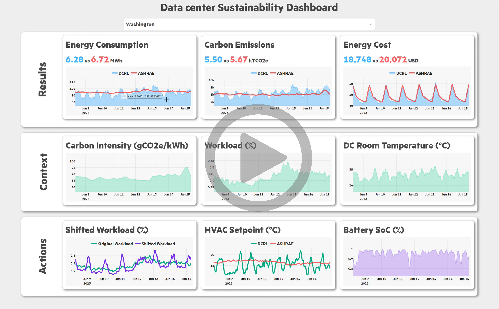

===================================
Monitor Results with |F| Dashboard
===================================

To get an in-depth look at the |F| dashboard and see real-time metrics, watch the video demonstration. The video showcases the dynamic plotting of variables from the agents, environments, and metrics, providing a comprehensive view of the DC operations.

Click on the screenshot below to watch the video (right-click and select "Open link in new tab" to view in a new tab):

In the video, you will see:
  - **Real-time plotting of agent variables:** Watch how the agents' actions and states are visualized dynamically
  - **Environment metrics:** Observe the DC's performance metrics, including energy consumption, cooling requirements, and workload distribution
  - **Interactive dashboard features:** Learn about the various interactive elements of the dashboard that allow for detailed analysis and monitoring

If you wish to download the video directly, `click here <https://www.dropbox.com/scl/fi/85gumlvjgbbk5kwjhee3i/Data-Center-Green-Dashboard-ver2.mp4?rlkey=w3mu21qqdk9asi826cjyyutzl&dl=1>`_.

Evaluation Metrics
------------------------

Some of the evaluation metrics implemented in |F| include:

  - Carbon Footprint (CFP): Cumulative carbon emissions over the evaluation period.
  - HVAC Energy: Energy consumed by the DC cooling system.
  - IT Energy: Energy consumed by the DC servers.
  - Water Usage: Efficient utilization of water for cooling.
  - Task Dropped: Number of dropped tasks due to workload scheduling.