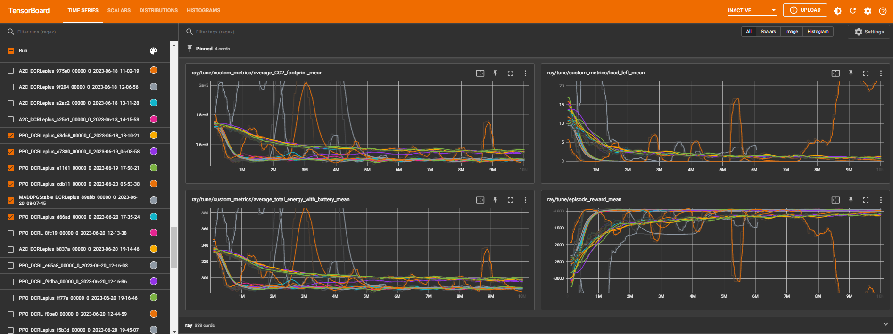

===================================
Monitor Results with TensorBoard
===================================

An alternative method to monitor results is using TensorBoard. |F| provides a custom callback implementation called :code:`CustomCallbacks` found in :code:`utils/rllib_callbacks.py` which can be used to track the performance of the model during training with TensorBoard.

After starting the training process, you can view the results using TensorBoard by running the following command in your terminal: :code:`tensorboard --logdir=/results/` and then navigating to the localhost URL that is displayed.

Once TensorBoard is running, you can view various metrics such as the average total energy with battery (:code:`total_energy_with_battery`), the average CO2 footprint (:code:`CO2_footprint_mean`), and the total load left (:code:`load_left_mean`). You can also monitor the model's progress by viewing graphs of the various metrics during training (such as :code:`episode_reward_mean`).

How to add Custom Metrics
--------------------------

To add new custom metrics to track during training with TensorBoard, you can modify the :code:`CustomCallbacks` class as follows:

  - Create a new key in the :code:`episode.user_data` dictionary in the :code:`on_episode_start` method.
  - Store or collect the value of the desired metric in the :code:`on_episode_step` method.
  - Continue to store or modify the value of the desired metric in the :code:`on_episode_end` method, a function that is called at the end of each episode in the training process and store the final metric value using the :code:`episode.custom_metrics` dictionary.

Once you have added the custom metric to the :code:`CustomCallbacks` class, you can view it in TensorBoard by selecting the appropriate metric from the dropdown list of metrics in the TensorBoard dashboard. Overall, adding custom metrics in this way gives you greater flexibility and control over the training process, allowing you to track specific metrics that are relevant to your use case and goals.

   An example of the tensorboard dashboard