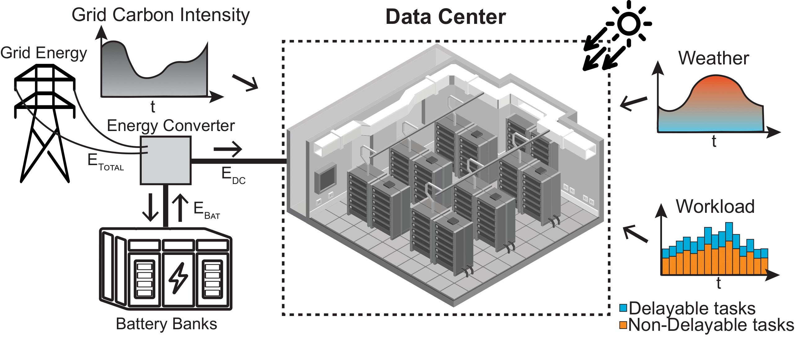

.. dc-rl documentation master file, created by
   sphinx-quickstart on Thu Jun  1 22:41:38 2024.
   You can adapt this file completely to your liking, but it should at least
   contain the root `toctree` directive.

|F|
==========

|F| is a set of Python environments for benchmarking multi-agent reinforcement learning (MARL) algorithms in data centers (DC). It focuses on sustainable DC operations, including workload scheduling, cooling optimization, and auxiliary battery management. 

This page contains the documentation for the GitHub `repository <https://github.com/HewlettPackard/dc-rl>`_ for the paper `"SustainDC: Benchmarking for Sustainable Data Center Control" <https://openreview.net/forum?id=UYgE9IfQIV>`_


**Disclaimer:** This work builds on our previous research and extends the methodologies and insights gained from our previous work. The original code, referred to as **DCRL-Green**, can be found in the `legacy branch <https://github.com/HewlettPackard/dc-rl/tree/legacy>`_ of this repository. The current repository, **SustainDC**, represents an advanced iteration of DCRL-Green, incorporating enhanced features and improved benchmarking capabilities. This evolution reflects our ongoing commitment to advancing sustainable data center control. Consequently, the repository name remains :code:`dc-rl` to maintain continuity with our previous work.


.. >Avisek Naug, Antonio Guillen, Ricardo Luna Gutierrez, Vineet Gundecha, Desik Rengarajan, Sahand Ghorbanpour, Sajad Mousavi, Ashwin Ramesh Babu, Dejan Markovikj, Lekhapriya Dheeraj Kashyap, Soumyendu Sarkar, "SustainDC: Benchmarking for Sustainable Data Center Control" in _Thirty-eight Conference on Neural Information Processing Systems Datasets and Benchmarks Track_[Online]. Available: [pdf](https://openreview.net/attachment?id=UYgE9IfQIV&name=pdf).

.. <details markdown="block">
.. <summary>BibTeX</summary>

.. ```tex
.. @inproceedings{naug2024sustaindc,
    title = {{SustainDC}: Benchmarking for Sustainable Data Center Control},
    author = {Naug, Avisek and Guillen, Antonio and Luna Gutierrez, Ricardo and Gundecha, Vineet and Rengarajan, Desik and Ghorbanpour, Sahand and Mousavi, Sajad and Babu, Ashwin Ramesh and Markovikj, Dejan and Dheeraj Kashyap, Lekhapriya and Sarkar, Soumyendu},
    year = 2024,
    month = 12,
    booktitle = {Thirty-eight Conference on Neural Information Processing Systems Datasets and Benchmarks Track},
    address = {Vancouver, Canada},
    url = {https://openreview.net/forum?id=UYgE9IfQIV}
.. }
.. ```
.. </details>

|F| uses OpenAI Gym standard and supports modeling and control of three different types of problems:

- Carbon-aware flexible computational load shifting
- Data center HVAC cooling energy optimization
- Carbon-aware battery auxiliary supply





Demo of |F|
-----------------

A demo of |F| is given in the Google Colab notebook below

.. image:: images/colab-badge.png
   :alt: GoogleColab
   :target: https://colab.research.google.com/drive/1AIe36Lo1Sl8OJXkS19D9D1TflLOTWvW4?usp=sharing


Features of |F|
-----------------

- **Highly Customizable and Scalable Environments:** Allows users to define and modify various aspects of DC operations, including server configurations, cooling systems, and workload traces.
- **Multi-Agent Support:** Enables testing of MARL controllers with both homogeneous and heterogeneous agents, facilitating the study of collaborative and competitive DC management strategies.
- **Gymnasium Integration:** Environments are wrapped in the Gymnasium :code:`Env` class, making it easy to benchmark different control strategies using standard reinforcement learning libraries.
- **Realistic External Variables:** Incorporates real-world data such as weather conditions, carbon intensity, and workload traces to simulate the dynamic and complex nature of DC operations.
- **Collaborative Reward Mechanisms:** Supports the design of custom reward structures to promote collaborative optimization across different DC components.
- **Benchmarking Suite:** Includes scripts and tools for evaluating the performance of various MARL algorithms, providing insights into their effectiveness in reducing energy consumption and carbon emissions.

.. toctree::
   :hidden:
   
   installation
   gettingstarted
   overview/index
   usage/index
   evaluation/index
   Code<code/modules>
   publications
   contribution_guidelines
   references
   genindex
   modindex

