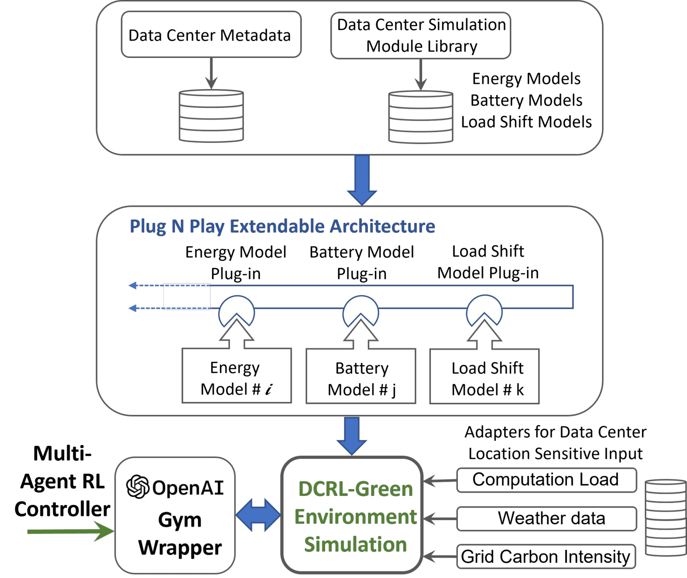

.. dc-rl documentation master file, created by
   sphinx-quickstart on Thu Jun  1 22:41:38 2023.
   You can adapt this file completely to your liking, but it should at least
   contain the root `toctree` directive.

DCRL-Green
==========

DCRL-green is a framework for testing multi-agent Reinforcement Learning (MARL) algorithm that optimizes data centers for multiple objectives of carbon footprint reduction, energy consumption, and energy
cost. It uses OpenAI Gym standard and supports modeling and control of three different types of problems: Carbon aware flexible load shifting, Data center HVAC cooling energy optimization and carbon aware battery auxiliary supply.

.. toctree::
   :hidden:
   
   installation/index
   gettingstarted
   usage/index
   overview/index
   code
   references

Indices and tables
==================

* :ref:`genindex`
* :ref:`modindex`
* :ref:`search`
