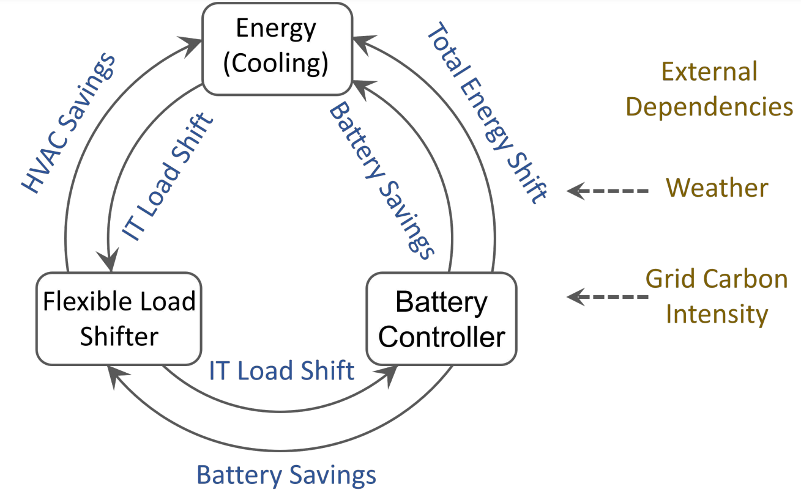

======
Agents
======

DCRL-Green consists of multiple agents that work together to optimize energy usage and reduce the carbon footprint of the data center. Each agent is responsible for controlling a specific component or aspect of the data center. The agents in DCRL-Green include:

1. Load Shifting Agent: This agent is responsible for scheduling and assigning flexible workloads within the data center. It optimizes the allocation of workloads to different time slots based on various factors, such as grid carbon intensity (CI), weather conditions, and external requirements. By intelligently shifting the workload to time slots with lower CI or higher availability of green energy, the load shifting agent reduces the environmental impact of data center operations and promotes energy efficiency.

2. DC Energy Optimizer Agent: This agent focuses on optimizing the energy consumption of the data center through HVAC cooling. It makes decisions on the temperature setpoint of the cooling system based on factors such as workload, grid CI, weather conditions, and thermal characteristics of the data center. By dynamically adjusting the cooling system's setpoint, the DC energy optimizer agent ensures efficient cooling while minimizing energy consumption and maintaining a safe operating environment for the data center infrastructure.

3. Battery Energy Storage Agent: This agent manages the battery energy storage system in the data center, typically stored in the Uninterrupted Power System (UPS). It monitors the power demand of the data center and the grid CI to determine when to charge or discharge the battery. During peak hours of high CI or grid instability, the battery energy storage agent can provide auxiliary energy supply to meet the data center's power requirements, reducing reliance on the grid and improving resilience.

   Internal and external system dependencies

========================
Inter-Model Dependencies
========================

The agents in DCRL-Green operate collaboratively, where their actions and decisions are taken using shared information. The load shifting agent, DC energy optimizer agent, and battery energy storage agent rely on each other's outputs and feedback to optimize energy usage and reduce the carbon footprint of the data center. Here are the key inter-model dependencies:

1. Load Shifting Agent to DC Energy Optimizer Agent: The load shifting agent's workload scheduling decisions directly influence the energy consumption of the data center. By allocating workloads to time slots with lower grid carbon intensity (CI) or higher availability of green energy, the load shifting agent reduces the environmental impact of data center operations. This workload allocation affects the workload and power demand of the data center, which in turn influences the temperature setpoint decisions made by the DC energy optimizer agent.

2. DC Energy Optimizer Agent to Load Shifting Agent: The temperature setpoint decisions made by the DC energy optimizer agent impact the energy consumption of the data center through HVAC cooling. By optimizing the temperature setpoints based on workload, grid CI, weather conditions, and thermal characteristics of the data center, the DC energy optimizer agent ensures efficient cooling while minimizing energy consumption. These temperature setpoints directly influence the workload scheduling decisions made by the load shifting agent, since if the DC Energy Optimizer attempts to reduce the internal temperature of the data center by employing a lower setpoint, the load shifting agent can shift the load to try to reduce the heat output of the servers within the data center.

3. Load Shifting Agent to Battery Energy Storage Agent: The load shifting agent's workload scheduling decisions also affect the power demand of the data center. If the load shifting agent schedules a large workload during peak hours, it increases the power demand from the grid. In such cases, the battery energy storage agent can decide to charge the battery to meet the additional power requirements and reduce the grid dependency. Conversely, if the load shifting agent schedules low-demand periods, the battery energy storage agent may choose to discharge the battery and reduce charging cycles.

4. Battery Energy Storage Agent to Load Shifting Agent and DC Energy Optimizer Agent: The decisions made by the battery energy storage agent on charging or discharging the battery are influenced by the power demand of the data center and the grid CI. If the battery energy storage agent observes high grid CI or grid instability, it may decide to discharge the battery to provide auxiliary energy supply and reduce reliance on the grid. These decisions impact the workload scheduling made by the load shifting agent and the temperature setpoints determined by the DC energy optimizer agent.

These inter-model dependencies allow the agents in DCRL-Green to collaborate and make informed decisions by considering the outputs and feedback from other agents. By leveraging these dependencies, the agents optimize energy usage, reduce the carbon footprint, and promote sustainability in data centers. It creates a holistic approach to data center management, where the actions of one agent affect the decisions and outcomes of other agents, leading to coordinated efforts in energy optimization.

=============================
Other Interesting Information
=============================

In addition to the collaborative MARL agents, DCRL-Green offers various customization options and features to further enhance the data center sustainability optimization process:

- Customization of DC Design: DCRL-Green allows users to specify individual servers within racks and customize the layout and characteristics of the data center infrastructure. This flexibility enables researchers and developers to simulate different data center configurations and evaluate the impact of different designs on energy consumption and sustainability.

- Customization of battery model: 

