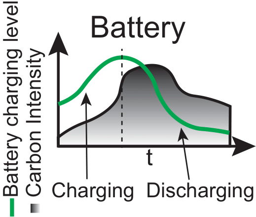

=====================
Battery Environment
=====================

The **Battery Environment** simulates the charging and discharging cycles of batteries used in the DC. It models how batteries can be charged from the grid during periods of low carbon intensity and provide auxiliary energy during periods of high carbon intensity.

.. _agent_bat_explanation:

Observation Space
-------------------
  - Time of Day and Year: Provides a periodic understanding of time using sine and cosine representations.
  - State of Charge (SoC): Current energy level of the battery.
  - Grid Energy Consumption: Combined energy consumption of IT and cooling systems.
  - Grid Carbon Intensity (CI): Current and forecasted carbon intensity values to determine optimal charging and discharging times.

Action Space
--------------
  - Charge Battery: Stores energy in the battery during periods of low carbon intensity.
  - Hold Energy: Maintains the current state of charge.
  - Discharge Battery: Provides auxiliary energy to the data center during periods of high carbon intensity.
