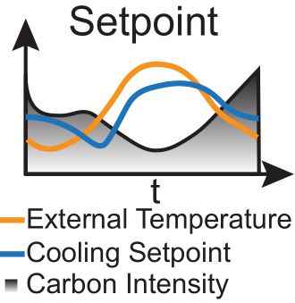

=====================
Data Center Environment
=====================

The **Data Center Environment** models the IT and HVAC systems of a data center, focusing on optimizing energy consumption and cooling. It simulates the electrical and thermal behavior of the DC components, including servers and cooling systems.

.. _data_center_modelled:

.. image:: ../images/Data_center_modelled.png
   :scale: 60 %
   :alt: Data Center Modelled
   :align: center

.. _agent_dc_explanation:

Observation Space
-------------------
  - Time of Day and Year: Provides a periodic understanding of time using sine and cosine representations.
  - Ambient Weather (Dry Bulb Temperature): Current outside temperature affecting the cooling load.
  - IT Room Temperature: Current temperature inside the data center, crucial for maintaining optimal server performance.
  - Previous Step Energy Consumption: Historical data on cooling and IT energy consumption for trend analysis.
  - Grid Carbon Intensity (CI): Forecasted carbon intensity values to optimize cooling strategies.

Action Space
--------------
  - Decrease Setpoint: Lowers the cooling setpoint to increase cooling, consuming more energy for cooling but reducing IT energy consumption.
  - Maintain Setpoint: Keeps the current cooling setpoint constant.
  - Increase Setpoint: Raises the cooling setpoint to reduce cooling energy consumption but increases IT energy consumption.
