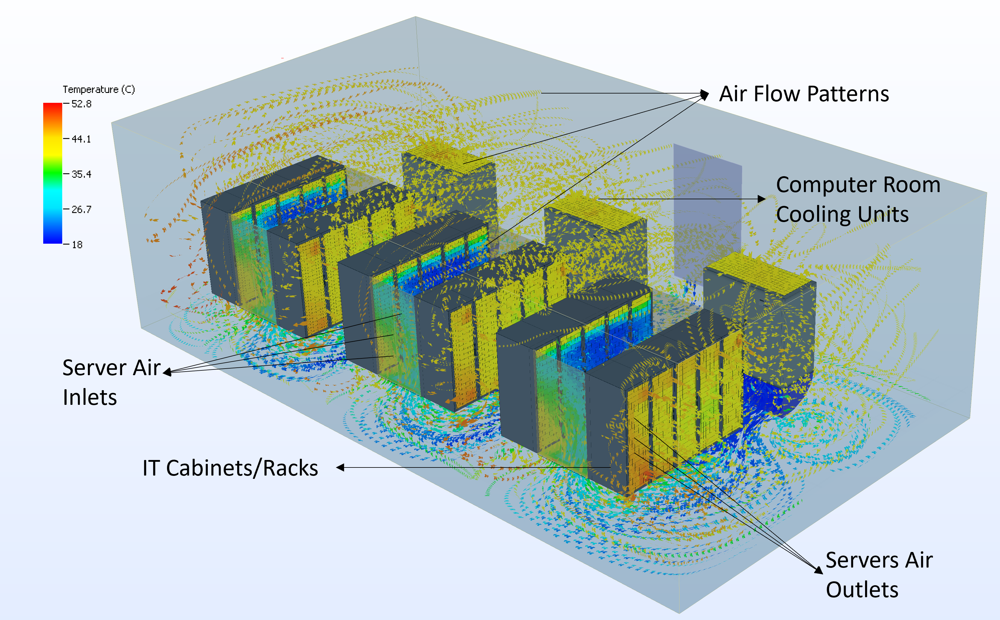

===========
Environment
===========

DCRL-Green provides a simulation framework for Data Centers (DCs) and evaluates multi-objective, collaborative MARL agents in this environment. 
Along with the flexibility to adjust other external settings such as the workload profile, the external weather pattern, and the grid carbon intensity (CI) as discussed in the :ref:`Usage` section, it provides customizable a JSON object file for three main sections:

1. DC geometry (rows, racks, workload, CRAC characteristics)
2. Server characteristics (power consumption)
3. HVAC characteristics (cooling mechanisms)

The model calculates Total IT power, CRAC fan power, and CRAC evaporator power, enabling real-time calculations for energy optimization.

Configure the DC Environment:
-----------------------------

Users can configure the simulation of the DC environment to suit their requirements. It may be configured by modifying the :code:`utils/dc_config.json` file in the GitHub_ repository.

.. _GitHub: https://github.com/HewlettPackard/dc-rl/blob/main/utils/dc_config.json

   Data center view in 6Sigma DCX from a given configuration file

1. Configure DC geometry
~~~~~~~~~~~~~~~~~~~~~~~~

The following DC specifications could be modified under the :code:`data_center_configuration` subsection:

.. csv-table::
   :file: ../tables/DC_geometry.csv
   :header-rows: 1

2. Configure server characteristics
~~~~~~~~~~~~~~~~~~~~~~~~~~~~~~~~~~~

The following DC specifications could be modified under the :code:`server_characteristics` subsection:

.. csv-table::
   :file: ../tables/DC_server_chars.csv
   :header-rows: 1

3. Configure HVAC Characteristics
~~~~~~~~~~~~~~~~~~~~~~~~~~~~~~~~~

The following DC specifications could be modified under the :code:`hvac_configuration` subsection:

.. csv-table::
   :file: ../tables/DC_hvac_chars.csv
   :header-rows: 1