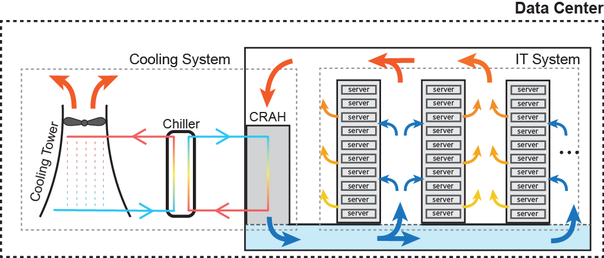

########################
SustainDC Environments
########################

Workload Environment
=====================

The **Workload Environment** manages the execution and scheduling of delayable workloads within the data center. It simulates the computational demand placed on the data center by using real-world workload traces from sources like Alibaba and Google.

.. _agent_ls_explanation:

.. image:: ../images/agent_ls_explanation.png
   :scale: 60 %
   :alt: LS agent
   :align: center

Observation Space
-------------------
  - Time of Day and Year: Provides a periodic understanding of time using sine and cosine representations.
  - Grid Carbon Intensity (CI): Includes current and forecasted carbon intensity values to help the agent optimize workload scheduling based on carbon emissions.
  - Rescheduled Workload Left: Tracks the amount of workload that has been rescheduled but not yet executed.

Action Space
--------------
  - Store Delayable Tasks: Allows the agent to store delayable tasks for future execution.
  - Compute All Immediate Tasks: Enables the agent to process all current tasks immediately.
  - Maximize Throughput: Balances immediate and delayed tasks based on the current carbon intensity.

Data Center Environment
=========================

The **Data Center Environment** models the IT and HVAC systems of a data center, focusing on optimizing energy consumption and cooling. It simulates the electrical and thermal behavior of the DC components, including servers and cooling systems.

.. _data_center_modelled:

.. _agent_dc_explanation:

.. image:: ../images/agent_dc_explanation.png
   :scale: 60 %
   :alt: DC Agent
   :align: center

Observation Space
-------------------
  - Time of Day and Year: Provides a periodic understanding of time using sine and cosine representations.
  - Ambient Weather (Dry Bulb Temperature): Current outside temperature affecting the cooling load.
  - IT Room Temperature: Current temperature inside the data center, crucial for maintaining optimal server performance.
  - Previous Step Energy Consumption: Historical data on cooling and IT energy consumption for trend analysis.
  - Grid Carbon Intensity (CI): Forecasted carbon intensity values to optimize cooling strategies.

Action Space
--------------
  - Decrease Setpoint: Lowers the cooling setpoint to increase cooling, consuming more energy for cooling but reducing IT energy consumption.
  - Maintain Setpoint: Keeps the current cooling setpoint constant.
  - Increase Setpoint: Raises the cooling setpoint to reduce cooling energy consumption but increases IT energy consumption.

Battery Environment
=====================

The **Battery Environment** simulates the charging and discharging cycles of batteries used in the DC. It models how batteries can be charged from the grid during periods of low carbon intensity and provide auxiliary energy during periods of high carbon intensity.

.. _agent_bat_explanation:

.. image:: ../images/agent_bat_explanation.png
   :scale: 60 %
   :alt: BAT Agent
   :align: center

Observation Space
-------------------
  - Time of Day and Year: Provides a periodic understanding of time using sine and cosine representations.
  - State of Charge (SoC): Current energy level of the battery.
  - Grid Energy Consumption: Combined energy consumption of IT and cooling systems.
  - Grid Carbon Intensity (CI): Current and forecasted carbon intensity values to determine optimal charging and discharging times.

Action Space
--------------
  - Charge Battery: Stores energy in the battery during periods of low carbon intensity.
  - Hold Energy: Maintains the current state of charge.
  - Discharge Battery: Provides auxiliary energy to the data center during periods of high carbon intensity.