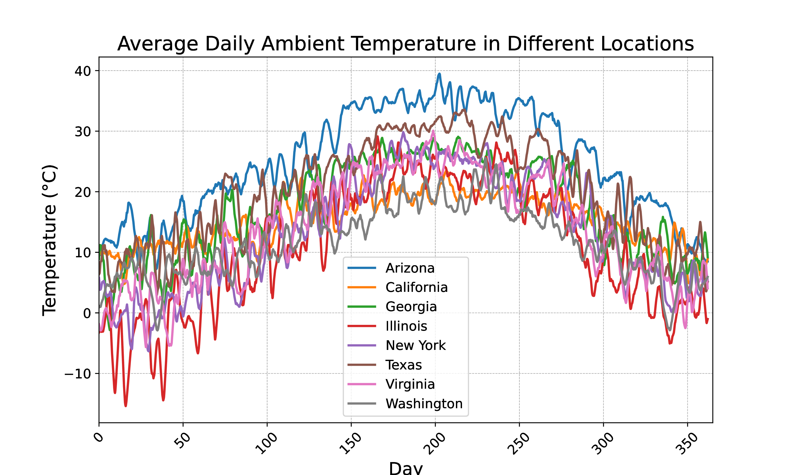

=================================
External Input Data
=================================

|F| uses external input data to provide a realistic simulation environment:

Workload
-------------------

The Workload external data in |F| represents the computational demand placed on the DC. By default, |F| includes a collection of open-source workload traces from Alibaba and Google DCs. 

Users can customize this component by adding new workload traces to the :code:`data/Workload` folder or specifying a path to existing traces in the :code:`sustaindc_env.py` file under the :code:`workload_file` configuration. Comparison between two workload traces of Alibaba trace (2017) and Google (2011) is given in the figure below.

.. image:: ../images/workload_comparison.png
   :scale: 20 %
   :alt: workload comparison
   :align: center

Weather
-------------------

The Weather external data in |F| captures the ambient environmental conditions impacting the DC's cooling requirements. By default, |F| includes weather data files in the :code:`.epw` format from various locations where DCs are commonly situated. These locations include Arizona, California, Georgia, Illinois, New York, Texas, Virginia, and Washington. 

Users can customize this component by adding new weather files to the :code:`data/Weather` folder or specifying a path to existing weather files in the :code:`sustaindc_env.py` file under the :code:`weather_file` configuration.

Each :code:`.epw` file contains hourly data for various weather parameters, but for our purposes, we focus on the ambient temperature. Comparison between external temperature of the different selected locations is given below.

Carbon Intensity
-------------------

The Carbon Intensity (CI) external data in |F| represents the carbon emissions associated with electricity consumption. By default, |F| includes CI data files for various locations: Arizona, California, Georgia, Illinois, New York, Texas, Virginia, and Washington. These files are located in the :code:`data/CarbonIntensity` folder and are extracted from this `zip file <https://api.eia.gov/bulk/EBA.zip>`_. 

Users can customize this component by adding new CI files to the :code:`data/CarbonIntensity` folder or specifying a path to existing files in the :code:`sustaindc_env.py` file under the :code:`cintensity_file` configuration. Comparison of carbon intensity across the different selected locations is given in the figure below

Furthermore, in the figure below, we show the average daily carbon intensity against the average daily coefficient of variation (CV) for various locations. This figure highlights an important perspective on the variability and magnitude of carbon intensity values across different regions. Locations with a high CV indicate greater fluctuation in carbon intensity, offering more "room to play" for DRL agents to effectively reduce carbon emissions through dynamic actions. Additionally, locations with a high average carbon intensity value present greater opportunities for achieving significant carbon emission reductions. The selected locations are highlighted, while other U.S. locations are also plotted for comparison. Regions with both high CV and high average carbon intensity are identified as prime targets for DRL agents to maximize their impact on reducing carbon emissions.

Below is a summary of the selected locations, typical weather values, and carbon emissions characteristics:

.. csv-table::
   :file: ../tables/ci_weather_location.csv
   :header-rows: 1