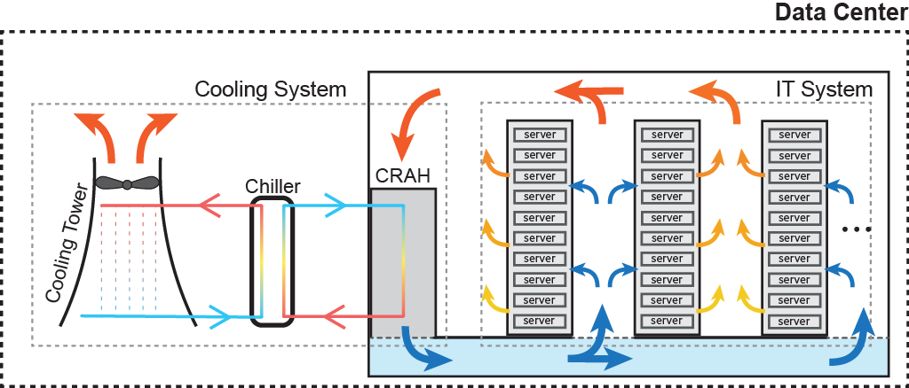
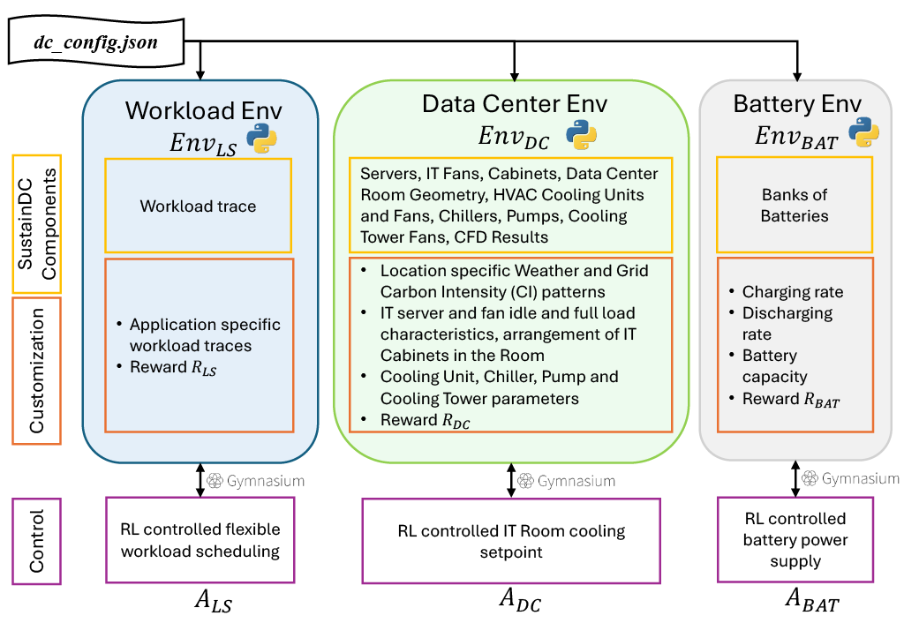

========
Overview
========

Data Center Model 
-----------------------
High-level overview of the operational model of a |F| data center is given in the figure below.

.. _sustaindc_model:

.. figure:: ../images/SustainDC.png
   :scale: 25 %
   :alt: Overview of the SustainDC main environments
   :align: center

Workloads are uploaded to the DC from a proxy client. A fraction of these jobs can be flexible or delayed to different time periods. The servers that process these jobs generate heat that needs to be removed from the DC. This is done by a complex HVAC system that ensures optimal temperature in the DC. As shown in the figure below, the warm air leaves the servers and is moved to the Computer Room Air Handler (CRAH) by the forced draft of the HVAC fan. Next, the hot air is cooled down to optimal setpoint using a chilled water loop and then send back to the IT room. Parallely, a second water loop transfers the removed heat to a cooling tower, where it is rejected to the outside environment. 

.. _sustaindc_hvac:

Big data centers also incorporate battery banks. Batteries can be charged from the grid during low Carbon Intensity (CI) periods. During higher CI periods, they provide auxiliary energy to the DC.  

Core Environments 
-----------------------

|F| consist of three interconnected environments that simulate various aspects of data center operations:

* **Workload Envronment** - model and control the execution and scheduling of delay-tolerant workloads within the DC 
* **Data Center Environment** - model and manage the servers in the IT room cabinets that process workloads and the HVAC system and components 
* **Battery Environment** - simulates the DC battery charging behavior during off-peak hours and provides auxiliary energy to the DC during peak grid carbon intensity periods

These environments work together to provide a comprehensive platform for benchmarking MARL algorithms aimed at optimizing energy consumption and reducing the carbon footprint of DCs.

|F| enables a comprehensive set of customizations for each of the three environments developed in Python. A high-level overview that highlights their individual components, customization capabilities, and associated control problems is given in th figure below.

.. _sustaindc_envs:

These three environments are interconnected to simulate realistic DC operations:

- The **Workload Environment** generates the computational demand that the **Data Center Environment** must process. This includes managing the scheduling of delayable tasks to optimize energy consumption and reduce the carbon footprint.

- The **Data Center Environment** handles the cooling and IT operations required to process the workloads. Higher computational demand results in increased heat generation, necessitating more cooling and energy consumption.

- The **Battery Environment** supports the DC by providing auxiliary energy during periods of high carbon intensity, helping to reduce the overall carbon footprint. It is affected by both the **Workload Environment** and the **Data Center Environment**. The workload impacts heat generation, which in turn affects the cooling requirements and energy consumption, influencing the battery's charging and discharging cycles.

Together, these interconnected environments provide a dynamic platform for benchmarking MARL algorithms, helping to develop strategies for more sustainable and efficient DC operations.

For more detals on each individual environment check the links below.

.. toctree::
   :maxdepth: 1

   environments
   interconnected
   .. workload
   .. datacenter
   .. battery

   .. model
   .. environment
   .. agents
   .. observations
   .. actions
   .. reward_function

   