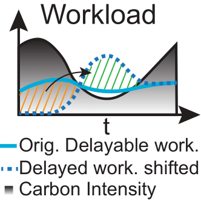

=====================
Workload Environment
=====================

The **Workload Environment** manages the execution and scheduling of delayable workloads within the data center. It simulates the computational demand placed on the data center by using real-world workload traces from sources like Alibaba and Google.

.. _agent_ls_explanation:

Observation Space
-------------------
  - Time of Day and Year: Provides a periodic understanding of time using sine and cosine representations.
  - Grid Carbon Intensity (CI): Includes current and forecasted carbon intensity values to help the agent optimize workload scheduling based on carbon emissions.
  - Rescheduled Workload Left: Tracks the amount of workload that has been rescheduled but not yet executed.

Action Space
--------------
  - Store Delayable Tasks: Allows the agent to store delayable tasks for future execution.
  - Compute All Immediate Tasks: Enables the agent to process all current tasks immediately.
  - Maximize Throughput: Balances immediate and delayed tasks based on the current carbon intensity.
